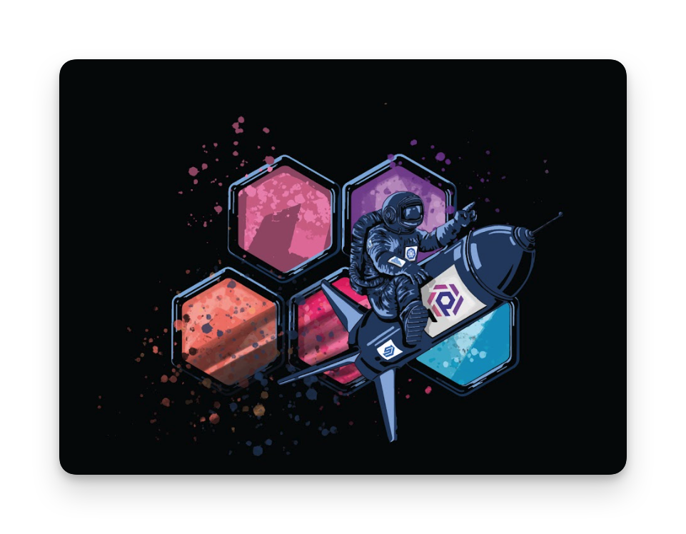

[](https://github.com/semantic-release/semantic-release)
# Hello Universe API

A Spectro Cloud demo application. This is the API server for the [Hello Universe](https://github.com/spectrocloud/hello-universe) app.

<p align="center">

</p>

# Overview
The [Hello Universe](https://github.com/spectrocloud/hello-universe) app includes an API server that expands the capabilities of the application. The API server requires a Postgres database to store and retrieve data. Use the [Hello Universe DB](https://github.com/spectrocloud/hello-universe-db) container for a simple integration with a Postgres database.

# Usage

The quickest method to start the API server locally is by using the Docker image. 

```shell
docker pull ghcr.io/spectrocloud/hello-universe-api:1.0.0
docker run -p 3000:3000 ghcr.io/spectrocloud/hello-universe-api:1.0.0
```

To start the API server you must have connectivity to a postgres instance. Use [environment variables](#environment-variables) to customize the API server start parameters.

## Environment Variables

The API server accepts the following environment variables.

| Variable    | Description                                        | Default   |
|-------------|----------------------------------------------------|-----------|
| `PORT`        | The port number the application will listen on.    | `3000`      |
| `HOST`        | The host value name the API server will listen on. | `localhost` |
| `DB_NAME`     | The database name.                                 | `counter`   |
| `DB_USER`     | The database user name to use for queries.         | `postgres`  |
| `DB_HOST`     | The hostname or url to the database.               | `localhost` |
| `DB_PASSWORD` | The database password.                             | `password`  |


